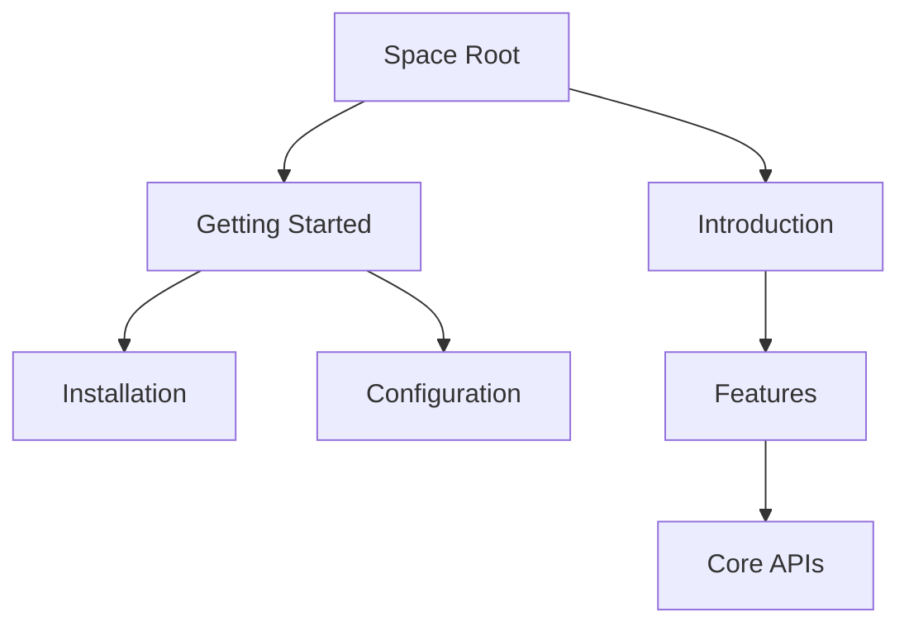

## Overview

Esen organizes your documentation into intuitive structures. You start with **spaces** to group related content, build **page hierarchies** for navigation, and enable **collaboration** for team workflows. These core concepts form the foundation of your documentation experience.

<Columns cols={3}>
  <Card title="Spaces" icon="layers" href="/docs/spaces">
    Containerize projects and teams.
  </Card>
  <Card title="Pages" icon="file-text" href="/docs/pages">
    Create nested content structures.
  </Card>
  <Card title="Collaboration" icon="users" href="/docs/collaboration">
    Share and manage permissions.
  </Card>
</Columns>

## Documentation Spaces

Spaces act as top-level containers for your documentation. You create a space for each project, team, or initiative to keep content organized and accessible.

<Steps>
  <Step title="Create a Space" icon="plus">
    Navigate to your dashboard and select **New Space**.

    Enter a name like `Project Alpha Docs` and choose visibility: public, private, or workspace-only.
  </Step>
  <Step title="Add Pages" icon="file-plus">
    Inside the space, create your first page using the **+ Page** button.

    Pages inherit the space's permissions by default.
  </Step>
  <Step title="Customize Settings" icon="settings">
    Access space settings to set branding, custom domains, or analytics.
  </Step>
</Steps>

<Callout kind="tip">
  Use descriptive names for spaces, such as `API Reference` or `User Guide`, to improve discoverability.
</Callout>

## Page Hierarchies

Pages form nested structures for logical navigation. You build hierarchies by nesting child pages under parents, creating sidebar menus automatically.



<Tabs>
  <Tab title="Sidebar View" icon="layout">
    Hierarchies appear as expandable menus in the sidebar. Users navigate depths up to five levels.
  </Tab>
  <Tab title="Breadcrumbs" icon="navigation">
    Show current path at the top: `Space > Parent > Child > Current Page`.
  </Tab>
</Tabs>

To link pages, use relative paths like `[Installation](./installation)` in your MDX content.

## Collaboration Basics

Invite team members to spaces and manage granular permissions. You control who can view, edit, or administer content.

| Role          | View | Edit | Admin |
|---------------|------|------|-------|
| Viewer        | ✅   | ❌   | ❌    |
| Editor        | ✅   | ✅   | ❌    |
| Administrator | ✅   | ✅   | ✅    |

<ExpandableGroup>
  <Expandable title="Advanced Permissions" default-open="false">
    Customize per-page overrides. For example, make a sensitive API page `Editor`-only within a public space.

    Use the permissions panel to add external collaborators via email invites.
  </Expandable>
</ExpandableGroup>

<CodeGroup tabs="Invite via UI,Invite via API">
  ```javascript
  // Example: Fetch space members
  const members = await fetch('/api/spaces/{spaceId}/members');
  console.log(members);
  ```
  ```bash
  # CLI invite (hypothetical)
  esen spaces invite {spaceId} user@example.com --role=editor
  ```
</CodeGroup>

These concepts scale from solo projects to enterprise teams. Start building your first space today to experience the workflow.