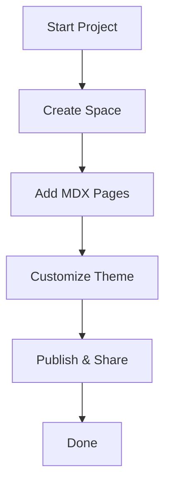

## What is Esen?

Esen provides a centralized platform where you create, organize, and manage documentation spaces for your projects. You build structured docs using MDX, with support for interactive components like tabs, steps, and cards. Customize themes, add search, and collaborate seamlessly with your team.

<Callout kind="info">
Esen handles rendering, hosting, and versioning automatically. Start writing MDX files and see live previews instantly.
</Callout>

## Key Benefits

Esen streamlines your documentation workflow with powerful features.

<Columns cols={3}>
  <Card title="Interactive Components" icon="components" href="/docs/components">
    Use built-in components like `<Steps>`, `<Tabs>`, and `<Cards>` to create engaging guides.
  </Card>
  <Card title="MDX Support" icon="file-text" href="/docs/mdx">
    Write in familiar Markdown with JSX extensions for dynamic content.
  </Card>
  <Card title="Version Control" icon="git-branch" href="/docs/versioning">
    Track changes and publish updates without downtime.
  </Card>
</Columns>

## Getting Oriented with the Dashboard

Navigate the Esen dashboard efficiently to manage your docs.

<Steps>
  <Step title="Access Your Workspace" icon="home">
    Log in at `https://app.esen.dev` and select your project space.
  </Step>
  <Step title="Explore Sections" icon="layout">
    Review the sidebar for Pages, Components, and Settings.
  </Step>
  <Step title="Edit Content" icon="edit-3">
    Click any page to open the MDX editor with live preview.
  </Step>
  <Step title="Publish Changes" icon="upload-cloud">
    Save and deploy to make updates live instantly.
  </Step>
</Steps>

<Tabs>
  <Tab title="Pages" icon="file">
    Manage your documentation hierarchy here. Create new pages with the `+` button.

    ```bash
    # Example: Create a new guide
    npx create-esen-page@latest --template guide
    ```
  </Tab>
  <Tab title="Settings" icon="settings">
    Configure your space theme and SEO.

    <Expandable title="Theme Customization" default-open="false">
      Edit `theme.config.js`:

      ```javascript
      // theme.config.js
      export default {
        brandColor: '#3B82F6',
        primaryFont: 'Inter',
        layout: 'default'
      };
      ```

      Restart your dev server to apply changes.
    </Expandable>
  </Tab>
</Tabs>

<CodeGroup tabs="JavaScript,TypeScript">
  ```javascript
  // Example API call to fetch docs
  const response = await fetch('https://api.esen.dev/v1/spaces/YOUR_SPACE_ID/docs');
  const docs = await response.json();
  console.log(docs);
  ```
  ```typescript
  // TypeScript version
  interface Doc {
    id: string;
    title: string;
    path: string;
  }

  const response = await fetch('https://api.esen.dev/v1/spaces/YOUR_SPACE_ID/docs');
  const docs: Doc[] = await response.json();
  console.log(docs);
  ```
</CodeGroup>



<Callout kind="tip">
Replace `YOUR_SPACE_ID` with your actual space identifier from the dashboard settings.
</Callout>